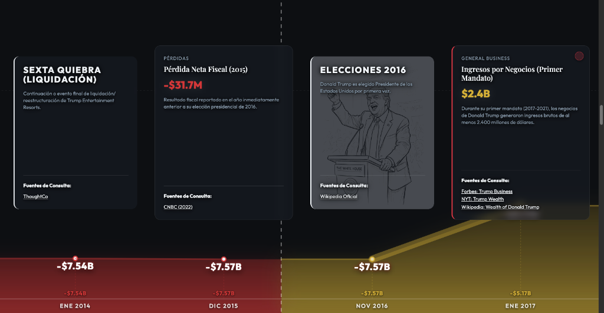

# From "Zero" to Hero: The Donald Trump Wealth Timeline



## 🚀 Visualización en Vivo
Puedes navegar el proyecto en: 
**[https://carlesgutierrez.github.io/DataVizFinancalsNewsTrump/](https://carlesgutierrez.github.io/DataVizFinancalsNewsTrump/)**

## 🖼️ Integración en IFRAME
Para integrar esta visualización en otro sitio web o artículo periodístico a pantalla completa, utiliza el siguiente código:

```html
<iframe 
  src="https://carlesgutierrez.github.io/DataVizFinancalsNewsTrump/" 
  style="width:100%; height:100vh; border:none;" 
  title="Trump Wealth Timeline">
</iframe>
```

## 🚀 Desarrollo Local
Para ejecutar el proyecto en tu máquina y disfrutar de **Hot Module Replacement (HMR)**:

1. **Instalar dependencias**: (solo la primera vez)
   ```bash
   npm install
   ```
2. **Arrancar el servidor de desarrollo**:
   ```bash
   npm run dev
   ```
3. **Acceder a la web**:
   Abre la URL que aparecerá en tu terminal (normalmente `http://localhost:5173`).

---

## 📦 Construcción para Producción
Vite optimiza todo el código y genera una versión lista para ser servida:

```bash
npm run build
```
Esto genera la carpeta `dist/`, la cual GitHub despliega automáticamente gracias a la Acción configurada.

## 📖 Sobre el Proyecto

Este proyecto nace única y exclusivamente de la curiosidad por los datos. Pretende visibilizar y ordenar de manera visual lo que ha sucedido financieramente a lo largo de décadas, basándose estrictamente en noticias, artículos y datos públicos. 

*"Todo hecho un Domingo en el que las noticias no dejan de dejarme petrificado y donde los datos son más que evidentes frente a nuestros ojos. Toca visibilizar la realidad y encontrar soluciones."*

## ⚠️ Aviso de Responsabilidad (Disclaimer)
El autor no se responsabiliza del mal uso, interpretación errónea o manipulación de esta web o de las herramientas de visualización derivadas de la misma.

## 🕵️‍♂️ Origen y Extracción de Datos
La semilla ideológica se basa en **"La noticia publicada en La Vanguardia (22/03/2026, por Javier de la Sotilla Puig)"**, que resume y amplía un análisis detallado del *New York Times (editorial de enero 2026)* sobre los ingresos y posibles conflictos de interés de Donald Trump y su familia durante su segundo mandato.

A partir de ese epicentro, toda la base de datos cronológica fue construida integrando:
- **Grok (Modo Avanzado):** Para realizar investigación de campo, _scrapping_ exhaustivo de reportes financieros y mapeo de datos públicos.
- **NotebookLM (via MCP - Model Context Protocol):** Para la ingesta estructurada, generación de síntesis de documentos y extracción profunda de los patrones de reciprocidad.

## 💻 Stack Tecnológico & Autoría

- **Autor:** Carles Gutiérrez – *Creative Technologist*
- **Flujo de Ejecución:** Proyecto iterado y "*Vibe-coded*" con Inteligencia Artificial utilizando **Antigravity**.
- **Desarrollo Frontend:** Construido puramente en **Vanilla JS** y Vanilla CSS para la manipulación óptima del DOM.
- **Librerías principales:** 
    - **GSAP & ScrollTrigger** (Transiciones de pantalla horizontales de alto impacto y anclaje).
    - **marked.js** (Inyección y renderizado de artículos markdown al vuelo).
    - **js-yaml** (Parseo de metadatos o _FrontMatter_ para organizar automáticamente tarjetas y etiquetas de evento).

## 📜 Licencia

Este código y material está liberado bajo la Licencia **MIT**. Eres libre de copiar, utilizar, distribuir y modificar totalmente la base de este proyecto interactivo para integrarlo en reportajes gráficos, periodismo ciudadano, o simplemente experimentación personal.
